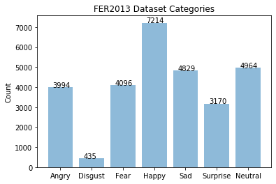
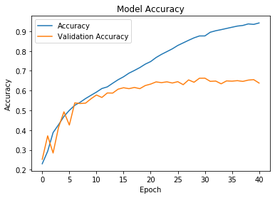
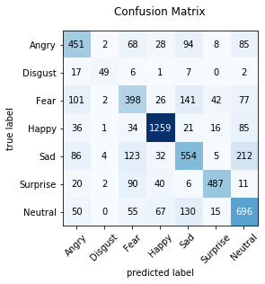
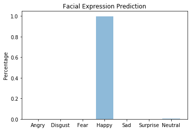
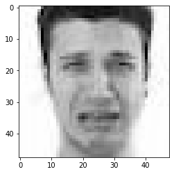
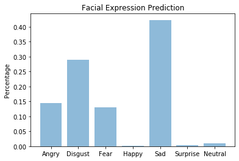
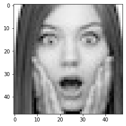
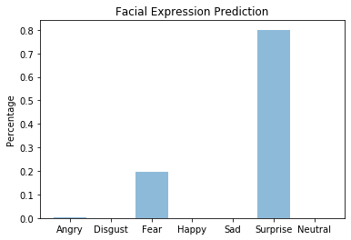

# Facial Expression Recognition Challenge using Convolutional Neural Network

## Abstract

Recently, I have developed a mobile game, [Best Actor](https://github.com/mikemikezhu/best-actor-ios), which uses computer vision model to recognize facial expressions. Specifically, the mobile game will randomly display a facial expression label (e.g. surprise) to the player. And the player has to mimic the facial expression so as to achieve a high score. Here I have designed a Convolutional Neural Network in order to perform facial expression recognition in the mobile game. This document will discuss the design and implementation details of the computer vision model.

## Computer Vision

### Download Data

Considering that the mobile game relies on computer vision model to make predictions on human facial expressions, we need to download the dataset to train the computer vision model. Here we use FER2013 dataset in [Challenges in Representation Learning: Facial Expression Recognition Challenge](https://www.kaggle.com/c/challenges-in-representation-learning-facial-expression-recognition-challenge/data) in Kaggle. Therefore, let's configure Kaggle API and download the training dataset.


```python
import os

# Configure kaggle
os.chdir('/root/')
!mkdir -p .kaggle
os.chdir('/root/.kaggle')
!wget --no-check-certificate 'https://docs.google.com/uc?export=download&id=1Y-o0TVcjehM8SZB3Nt8U3xkyeQu-Nse-' -O kaggle.json > /dev/null 2>&1
!ls /root/.kaggle

# Set permissions 
!chmod 600 /root/.kaggle/kaggle.json

# Create data folder
os.chdir('/content/')
!rm -rf data
!mkdir data
os.chdir('data')
!pwd

# Download data
!pip install -q kaggle
!kaggle competitions download -c challenges-in-representation-learning-facial-expression-recognition-challenge

# Unzip data
!unzip train.csv.zip train.csv
```

    kaggle.json
    /content/data
    Warning: Looks like you're using an outdated API Version, please consider updating (server 1.5.6 / client 1.5.4)
    Downloading icml_face_data.csv.zip to /content/data
     68% 66.0M/96.6M [00:00<00:00, 83.5MB/s]
    100% 96.6M/96.6M [00:00<00:00, 244MB/s] 
    Downloading example_submission.csv to /content/data
      0% 0.00/7.01k [00:00<?, ?B/s]
    100% 7.01k/7.01k [00:00<00:00, 6.91MB/s]
    Downloading train.csv.zip to /content/data
     84% 65.0M/77.3M [00:01<00:00, 32.5MB/s]
    100% 77.3M/77.3M [00:01<00:00, 48.6MB/s]
    Downloading test.csv.zip to /content/data
     47% 9.00M/19.3M [00:00<00:00, 75.3MB/s]
    100% 19.3M/19.3M [00:00<00:00, 94.6MB/s]
    Downloading fer2013.tar.gz to /content/data
     79% 73.0M/92.0M [00:00<00:00, 225MB/s]
    100% 92.0M/92.0M [00:00<00:00, 233MB/s]
    Archive:  train.csv.zip
      inflating: train.csv               


### Load Data

The image dataset downloaded from Kaggle is in ".csv" file format. Therefore, we need to load the "train.csv" file, and convert it to numpy array. The training images and labels are saved in "x_train" and "y_train" respectively.


```python
import csv
import numpy

train_images = []
train_labels = []

categories_count = {}

with open('train.csv') as train:

    # Read train.csv file
    csv_reader = csv.reader(train)
    next(csv_reader)  # Skip the header

    for row in csv_reader:

        # Append image
        pixels_str = row[1]
        pixels_list = [int(i) for i in pixels_str.split(' ')]
        pixels_list = numpy.array(pixels_list, dtype='uint8')
        image = pixels_list.reshape((48, 48))
        train_images.append(image)

        label_str = row[0]

        # Calculate categories count
        count = 0
        if label_str in categories_count:
            count = categories_count[label_str] + 1
        categories_count[label_str] = count

        # Append label
        label = int(label_str)
        train_labels.append(label)

# Create numpy array of train images and labels
x_train = numpy.array(train_images)
y_train = numpy.array(train_labels)

print('x_train shape: {0}'.format(x_train.shape))
print('y_train shape: {0}'.format(y_train.shape))
```

    x_train shape: (28709, 48, 48)
    y_train shape: (28709,)


The image dataset provided by Kaggle contains 7 different facial expression categories (0=Angry, 1=Disgust, 2=Fear, 3=Happy, 4=Sad, 5=Surprise, 6=Neutral). The distogram of the facial expression categories is displayed as follows.


```python
import matplotlib.pyplot as plt
%matplotlib inline

categories = ('Angry', 'Disgust', 'Fear', 'Happy', 'Sad', 'Surprise', 'Neutral')
y_pos = numpy.arange(len(categories))

counts = []
for label in range(len(categories)):
    label_str = str(label)
    count = categories_count[label_str]
    counts.append(count)
    plt.text(label - 0.25, count + 15, str(count))

# Draw histogram
plt.bar(y_pos, counts, align='center', alpha=0.5)
plt.xticks(y_pos, categories)
plt.ylabel('Count')
plt.title('FER2013 Dataset Categories')

plt.show()
```





Then, let's show one of the images in the dataset. Each image is grey-scale and contains 48 x 48 pixels.


```python
image = x_train[0]
label = y_train[0]

print('Label is: ' + str(label))
plt.imshow(image, cmap='gray')
```

    Label is: 0


    <matplotlib.image.AxesImage at 0x7fc0e5a696a0>


### Preprocess Data

Next, we need to split the dataset into training set and test set. Here, we choose 20% of the dataset as test set, and the rest of the dataset as train set.


```python
from sklearn.model_selection import train_test_split

# Split dataset into train set and test set
x_train, x_test, y_train, y_test = train_test_split(x_train, y_train, test_size=0.2)
x_train, x_test = x_train / 255.0, x_test / 255.0

x_train = x_train.reshape(len(x_train), 48, 48, 1)
x_test = x_test.reshape(len(x_test), 48, 48, 1)

print(x_train.shape)
print(x_test.shape)
```

    (22967, 48, 48, 1)
    (5742, 48, 48, 1)


### Train Model

Next, we need to train the model with the image dataset. Here we use Tensorlow as backend to train the model. Therefore, we need to import all the required packages before the training process.


```python
%tensorflow_version 2.x
import tensorflow as tf

print('Tensorflow version: {}'.format(tf.__version__))

from tensorflow.keras.models import Sequential
from tensorflow.keras.layers import Conv2D, BatchNormalization, MaxPool2D, Dropout, Flatten, Dense

from tensorflow.keras.optimizers import Adam
from tensorflow.keras.callbacks import EarlyStopping, ReduceLROnPlateau

from tensorflow.keras import Model, Input

from tensorflow.keras.preprocessing.image import ImageDataGenerator
```

    TensorFlow 2.x selected.
    Tensorflow version: 2.1.0


By referring to VGGNet architecture, we have designed the computer vision model with several stacks of layers. The model will have the following components:
- Convolutional layers: These layers are the building blocks of our architecture, which learns the image feature by computing the dot product between the weights and the small region on the image. Similar to VGGNet architecture, all the convolutional layers are designed with 3 x 3 kernal size, and several filters.
- Activation functions: The activation functions are those functions which are applied to the outputs of the layers in the network. Specifically, we use ReLU (Rectified Linear Unit) activation function to increase the non-linearity of the network. Besides, a Softmax function will be used to compute the probability of each category.
- Pooling layers: These layers will down-sample the image to reduce the spatial data and extract features. In our model, we will use Max Pooling with A 3 x 3 pooling size and a 2 x 2 stride.
- Dense layers: The dense layers are stacked as the fully connected layers of the network, which take in the feature data from the previous convolutional layers and perform decision making.
- Dropout layers: The dropout layers are used to prevent over-fitting when training the model.
- Batch normalization: This technique can be used to speed up learning by normalizing the output of the previous activation layer. 

The diagram of the model is displayed as follows.


Our model contains 5 stacks of layers. In each of the first 4 stacks of layers, there are 2 convolutional layer followed by 1 pooling layer. Besides, we use batch normalization to speed up training and dropout to prevent over-fitting. Then we have one stack of 3 fully-connected layers, followed by a Softmax activation function, which generates the probability of the facial expression categories. Finally, we compile our model using Adam optimizer with a certain learning rate. Considering that we are dealing with classification issue, we will use `sparse_categorical_crossentropy` as the loss function.


```python
cnn_model = Sequential()

# 1st convolution layer
cnn_model.add(Conv2D(64, input_shape=(48, 48, 1), kernel_size=(3, 3), activation='relu'))
cnn_model.add(BatchNormalization())
cnn_model.add(Conv2D(64, padding='same', kernel_size=(3, 3), activation='relu'))
cnn_model.add(BatchNormalization())
cnn_model.add(MaxPool2D(pool_size=(3, 3), strides=(2, 2)))
cnn_model.add(Dropout(0.3))

# 2nd convolution layer
cnn_model.add(Conv2D(128, padding='same', kernel_size=(3, 3), activation='relu'))
cnn_model.add(BatchNormalization())
cnn_model.add(Conv2D(128, padding='same', kernel_size=(3, 3), activation='relu'))
cnn_model.add(BatchNormalization())
cnn_model.add(MaxPool2D(pool_size=(3, 3), strides=(2, 2)))
cnn_model.add(Dropout(0.3))

# 3rd convolution layer
cnn_model.add(Conv2D(256, padding='same', kernel_size=(3, 3), activation='relu'))
cnn_model.add(BatchNormalization())
cnn_model.add(Conv2D(256, padding='same', kernel_size=(3, 3), activation='relu'))
cnn_model.add(BatchNormalization())
cnn_model.add(MaxPool2D(pool_size=(3, 3), strides=(2, 2)))
cnn_model.add(Dropout(0.3))

# 4th convolution layer
cnn_model.add(Conv2D(512, padding='same', kernel_size=(3, 3), activation='relu'))
cnn_model.add(BatchNormalization())
cnn_model.add(Conv2D(512, padding='same', kernel_size=(3, 3), activation='relu'))
cnn_model.add(BatchNormalization())
cnn_model.add(MaxPool2D(pool_size=(3, 3), strides=(2, 2)))
cnn_model.add(Dropout(0.3))

# Fully connected layer
cnn_model.add(Flatten())
cnn_model.add(Dense(512, activation='relu'))
cnn_model.add(Dropout(0.3))
cnn_model.add(Dense(256, activation='relu'))
cnn_model.add(Dropout(0.3))
cnn_model.add(Dense(64, activation='relu'))
cnn_model.add(Dropout(0.3))

cnn_model.add(Dense(7, activation='softmax'))

# Compile the model
adam = Adam(learning_rate=0.001)
cnn_model.compile(optimizer=adam,
                  loss='sparse_categorical_crossentropy',
                  metrics=['accuracy'])

# Summary the model
cnn_model.summary()
```

    Model: "sequential"
    _________________________________________________________________
    Layer (type)                 Output Shape              Param #   
    =================================================================
    conv2d (Conv2D)              (None, 46, 46, 64)        640       
    _________________________________________________________________
    batch_normalization (BatchNo (None, 46, 46, 64)        256       
    _________________________________________________________________
    conv2d_1 (Conv2D)            (None, 46, 46, 64)        36928     
    _________________________________________________________________
    batch_normalization_1 (Batch (None, 46, 46, 64)        256       
    _________________________________________________________________
    max_pooling2d (MaxPooling2D) (None, 22, 22, 64)        0         
    _________________________________________________________________
    dropout (Dropout)            (None, 22, 22, 64)        0         
    _________________________________________________________________
    conv2d_2 (Conv2D)            (None, 22, 22, 128)       73856     
    _________________________________________________________________
    batch_normalization_2 (Batch (None, 22, 22, 128)       512       
    _________________________________________________________________
    conv2d_3 (Conv2D)            (None, 22, 22, 128)       147584    
    _________________________________________________________________
    batch_normalization_3 (Batch (None, 22, 22, 128)       512       
    _________________________________________________________________
    max_pooling2d_1 (MaxPooling2 (None, 10, 10, 128)       0         
    _________________________________________________________________
    dropout_1 (Dropout)          (None, 10, 10, 128)       0         
    _________________________________________________________________
    conv2d_4 (Conv2D)            (None, 10, 10, 256)       295168    
    _________________________________________________________________
    batch_normalization_4 (Batch (None, 10, 10, 256)       1024      
    _________________________________________________________________
    conv2d_5 (Conv2D)            (None, 10, 10, 256)       590080    
    _________________________________________________________________
    batch_normalization_5 (Batch (None, 10, 10, 256)       1024      
    _________________________________________________________________
    max_pooling2d_2 (MaxPooling2 (None, 4, 4, 256)         0         
    _________________________________________________________________
    dropout_2 (Dropout)          (None, 4, 4, 256)         0         
    _________________________________________________________________
    conv2d_6 (Conv2D)            (None, 4, 4, 512)         1180160   
    _________________________________________________________________
    batch_normalization_6 (Batch (None, 4, 4, 512)         2048      
    _________________________________________________________________
    conv2d_7 (Conv2D)            (None, 4, 4, 512)         2359808   
    _________________________________________________________________
    batch_normalization_7 (Batch (None, 4, 4, 512)         2048      
    _________________________________________________________________
    max_pooling2d_3 (MaxPooling2 (None, 1, 1, 512)         0         
    _________________________________________________________________
    dropout_3 (Dropout)          (None, 1, 1, 512)         0         
    _________________________________________________________________
    flatten (Flatten)            (None, 512)               0         
    _________________________________________________________________
    dense (Dense)                (None, 512)               262656    
    _________________________________________________________________
    dropout_4 (Dropout)          (None, 512)               0         
    _________________________________________________________________
    dense_1 (Dense)              (None, 256)               131328    
    _________________________________________________________________
    dropout_5 (Dropout)          (None, 256)               0         
    _________________________________________________________________
    dense_2 (Dense)              (None, 64)                16448     
    _________________________________________________________________
    dropout_6 (Dropout)          (None, 64)                0         
    _________________________________________________________________
    dense_3 (Dense)              (None, 7)                 455       
    =================================================================
    Total params: 5,102,791
    Trainable params: 5,098,951
    Non-trainable params: 3,840
    _________________________________________________________________


Next, we will train our model. Here we use Early Stopping strategy, which will stop the training process when there is no improvement in the validation accuracy. Besides, we will also reduce the learning rate by a specific factor if there is a plateau is detected in the validation loss.


```python
# Callbacks
early_stopping = EarlyStopping(monitor='val_accuracy', patience=10)
reduce_learning_rate = ReduceLROnPlateau(monitor='val_loss', factor=0.9, patience=5)

# Train the model
history = cnn_model.fit(x_train,
                        y_train,
                        batch_size=64,
                        epochs=100,
                        validation_data=(x_test, y_test),
                        callbacks=[early_stopping, reduce_learning_rate])
```

    Train on 22967 samples, validate on 5742 samples
    Epoch 1/100
    22967/22967 [==============================] - 26s 1ms/sample - loss: 1.8757 - accuracy: 0.2304 - val_loss: 1.8284 - val_accuracy: 0.2529
    Epoch 2/100
    22967/22967 [==============================] - 16s 678us/sample - loss: 1.7341 - accuracy: 0.2934 - val_loss: 1.6207 - val_accuracy: 0.3715
    Epoch 3/100
    22967/22967 [==============================] - 16s 681us/sample - loss: 1.5329 - accuracy: 0.3879 - val_loss: 2.3653 - val_accuracy: 0.2847
    Epoch 4/100
    22967/22967 [==============================] - 16s 682us/sample - loss: 1.4278 - accuracy: 0.4273 - val_loss: 1.4887 - val_accuracy: 0.4136
    Epoch 5/100
    22967/22967 [==============================] - 16s 685us/sample - loss: 1.3583 - accuracy: 0.4694 - val_loss: 1.3731 - val_accuracy: 0.4929
    Epoch 6/100
    22967/22967 [==============================] - 16s 687us/sample - loss: 1.2918 - accuracy: 0.5003 - val_loss: 1.4911 - val_accuracy: 0.4260
    Epoch 7/100
    22967/22967 [==============================] - 16s 692us/sample - loss: 1.2477 - accuracy: 0.5258 - val_loss: 1.2053 - val_accuracy: 0.5381
    Epoch 8/100
    22967/22967 [==============================] - 16s 692us/sample - loss: 1.2135 - accuracy: 0.5412 - val_loss: 1.2070 - val_accuracy: 0.5347
    Epoch 9/100
    22967/22967 [==============================] - 16s 688us/sample - loss: 1.1723 - accuracy: 0.5600 - val_loss: 1.2278 - val_accuracy: 0.5369
    Epoch 10/100
    22967/22967 [==============================] - 16s 686us/sample - loss: 1.1405 - accuracy: 0.5765 - val_loss: 1.1934 - val_accuracy: 0.5589
    Epoch 11/100
    22967/22967 [==============================] - 16s 687us/sample - loss: 1.1002 - accuracy: 0.5925 - val_loss: 1.1409 - val_accuracy: 0.5778
    Epoch 12/100
    22967/22967 [==============================] - 16s 685us/sample - loss: 1.0595 - accuracy: 0.6106 - val_loss: 1.1360 - val_accuracy: 0.5655
    Epoch 13/100
    22967/22967 [==============================] - 16s 689us/sample - loss: 1.0324 - accuracy: 0.6188 - val_loss: 1.1228 - val_accuracy: 0.5881
    Epoch 14/100
    22967/22967 [==============================] - 16s 687us/sample - loss: 0.9968 - accuracy: 0.6373 - val_loss: 1.1030 - val_accuracy: 0.5876
    Epoch 15/100
    22967/22967 [==============================] - 16s 685us/sample - loss: 0.9516 - accuracy: 0.6552 - val_loss: 1.1632 - val_accuracy: 0.6075
    Epoch 16/100
    22967/22967 [==============================] - 16s 688us/sample - loss: 0.9075 - accuracy: 0.6700 - val_loss: 1.0542 - val_accuracy: 0.6146
    Epoch 17/100
    22967/22967 [==============================] - 16s 691us/sample - loss: 0.8639 - accuracy: 0.6882 - val_loss: 1.1217 - val_accuracy: 0.6099
    Epoch 18/100
    22967/22967 [==============================] - 16s 688us/sample - loss: 0.8284 - accuracy: 0.7018 - val_loss: 1.0902 - val_accuracy: 0.6160
    Epoch 19/100
    22967/22967 [==============================] - 16s 685us/sample - loss: 0.7877 - accuracy: 0.7165 - val_loss: 1.1438 - val_accuracy: 0.6099
    Epoch 20/100
    22967/22967 [==============================] - 16s 687us/sample - loss: 0.7511 - accuracy: 0.7337 - val_loss: 1.1213 - val_accuracy: 0.6256
    Epoch 21/100
    22967/22967 [==============================] - 16s 687us/sample - loss: 0.7104 - accuracy: 0.7469 - val_loss: 1.1857 - val_accuracy: 0.6331
    Epoch 22/100
    22967/22967 [==============================] - 16s 683us/sample - loss: 0.6539 - accuracy: 0.7672 - val_loss: 1.1355 - val_accuracy: 0.6440
    Epoch 23/100
    22967/22967 [==============================] - 16s 686us/sample - loss: 0.6118 - accuracy: 0.7833 - val_loss: 1.1909 - val_accuracy: 0.6404
    Epoch 24/100
    22967/22967 [==============================] - 16s 685us/sample - loss: 0.5708 - accuracy: 0.7972 - val_loss: 1.1670 - val_accuracy: 0.6444
    Epoch 25/100
    22967/22967 [==============================] - 16s 685us/sample - loss: 0.5430 - accuracy: 0.8112 - val_loss: 1.2351 - val_accuracy: 0.6385
    Epoch 26/100
    22967/22967 [==============================] - 16s 688us/sample - loss: 0.4982 - accuracy: 0.8281 - val_loss: 1.2673 - val_accuracy: 0.6452
    Epoch 27/100
    22967/22967 [==============================] - 16s 683us/sample - loss: 0.4561 - accuracy: 0.8412 - val_loss: 1.4775 - val_accuracy: 0.6301
    Epoch 28/100
    22967/22967 [==============================] - 16s 685us/sample - loss: 0.4233 - accuracy: 0.8544 - val_loss: 1.2860 - val_accuracy: 0.6541
    Epoch 29/100
    22967/22967 [==============================] - 16s 685us/sample - loss: 0.3880 - accuracy: 0.8667 - val_loss: 1.3489 - val_accuracy: 0.6423
    Epoch 30/100
    22967/22967 [==============================] - 16s 685us/sample - loss: 0.3702 - accuracy: 0.8762 - val_loss: 1.3640 - val_accuracy: 0.6627
    Epoch 31/100
    22967/22967 [==============================] - 16s 685us/sample - loss: 0.3567 - accuracy: 0.8763 - val_loss: 1.3474 - val_accuracy: 0.6630
    Epoch 32/100
    22967/22967 [==============================] - 16s 689us/sample - loss: 0.3131 - accuracy: 0.8951 - val_loss: 1.6062 - val_accuracy: 0.6468
    Epoch 33/100
    22967/22967 [==============================] - 16s 685us/sample - loss: 0.2903 - accuracy: 0.9026 - val_loss: 1.4864 - val_accuracy: 0.6484
    Epoch 34/100
    22967/22967 [==============================] - 16s 686us/sample - loss: 0.2759 - accuracy: 0.9081 - val_loss: 1.4937 - val_accuracy: 0.6344
    Epoch 35/100
    22967/22967 [==============================] - 16s 685us/sample - loss: 0.2593 - accuracy: 0.9142 - val_loss: 1.6131 - val_accuracy: 0.6491
    Epoch 36/100
    22967/22967 [==============================] - 16s 686us/sample - loss: 0.2403 - accuracy: 0.9203 - val_loss: 1.6904 - val_accuracy: 0.6479
    Epoch 37/100
    22967/22967 [==============================] - 16s 684us/sample - loss: 0.2291 - accuracy: 0.9262 - val_loss: 1.6712 - val_accuracy: 0.6503
    Epoch 38/100
    22967/22967 [==============================] - 16s 684us/sample - loss: 0.2120 - accuracy: 0.9293 - val_loss: 1.6716 - val_accuracy: 0.6466
    Epoch 39/100
    22967/22967 [==============================] - 16s 686us/sample - loss: 0.1862 - accuracy: 0.9371 - val_loss: 1.9402 - val_accuracy: 0.6531
    Epoch 40/100
    22967/22967 [==============================] - 16s 685us/sample - loss: 0.1930 - accuracy: 0.9347 - val_loss: 1.7538 - val_accuracy: 0.6555
    Epoch 41/100
    22967/22967 [==============================] - 16s 686us/sample - loss: 0.1779 - accuracy: 0.9419 - val_loss: 1.9947 - val_accuracy: 0.6383


After the training process is completed, let's display the accuracy diagram of the training accuracy and validation accuracy.


```python
# Show accuracy diagram
plt.title('Model Accuracy')
plt.plot(history.history['accuracy'], label='accuracy')
plt.plot(history.history['val_accuracy'], label='val_accuracy')
plt.xlabel('Epoch')
plt.ylabel('Accuracy')
plt.legend(['Accuracy', 'Validation Accuracy'])
plt.show()
```





### Improve Model

We will try to improve our model to increase the validation accuracy. Here we have used the following techniques in our model improvement:
- Generate hard data
- Data augmentation

Before we improve our model, let's evaluate our model by using test set. We can see the score before improvement is around 64%.


```python
# Evaluate the model before improvement
_, score_before_improvement = cnn_model.evaluate(x_test, y_test)
print('Score before improvement: {}'.format(score_before_improvement))
```

    5742/5742 [==============================] - 2s 337us/sample - loss: 1.9947 - accuracy: 0.6383
    Score before improvement: 0.6382793188095093


Next, we will improve our model by generating hard data. Specifically, instead of training the model over and over again, we will select the images which are incorrectly labelled by the model, and train the model on these specific images. Therefore, let's use our model to make predictions first, and put the incorrect ones into the array of hard data for further training.


```python
# Generate hard data
hard_images = []
hard_labels = []

# Make predictions
predictions = cnn_model.predict(x_test)
for i, v in enumerate(predictions):
    y_predict = numpy.argmax(v)
    y_real = y_train[i]
    if y_predict != y_real:
        # If predict incorrectly, append to array
        image = x_train[i]
        hard_image = image.reshape(1, 48, 48, 1)
        hard_images.append(image)
        hard_labels.append(y_real)

x_hard = numpy.array(hard_images)
y_hard = numpy.array(hard_labels)

print(x_hard.shape)
print(y_hard.shape)
```

    (4775, 48, 48, 1)
    (4775,)


Next, we will train our model on these specific images which are previously incorrectly labelled by our model.


```python
# Train the model on hard data
x_hard_train, x_hard_test, y_hard_train, y_hard_test = train_test_split(x_hard, y_hard, test_size=0.2)
history = cnn_model.fit(x_hard_train,
                        y_hard_train,
                        batch_size=64,
                        epochs=100,
                        validation_data=(x_hard_test, y_hard_test),
                        callbacks=[early_stopping, reduce_learning_rate])
```

    Train on 3820 samples, validate on 955 samples
    Epoch 1/100
    3820/3820 [==============================] - 4s 1ms/sample - loss: 0.1810 - accuracy: 0.9406 - val_loss: 0.0398 - val_accuracy: 0.9874
    Epoch 2/100
    3820/3820 [==============================] - 3s 685us/sample - loss: 0.1333 - accuracy: 0.9542 - val_loss: 0.0413 - val_accuracy: 0.9832
    Epoch 3/100
    3820/3820 [==============================] - 3s 686us/sample - loss: 0.0935 - accuracy: 0.9691 - val_loss: 0.0455 - val_accuracy: 0.9864
    Epoch 4/100
    3820/3820 [==============================] - 3s 693us/sample - loss: 0.1113 - accuracy: 0.9636 - val_loss: 0.1021 - val_accuracy: 0.9686
    Epoch 5/100
    3820/3820 [==============================] - 3s 687us/sample - loss: 0.0914 - accuracy: 0.9741 - val_loss: 0.0544 - val_accuracy: 0.9801
    Epoch 6/100
    3820/3820 [==============================] - 3s 689us/sample - loss: 0.0755 - accuracy: 0.9775 - val_loss: 0.0646 - val_accuracy: 0.9791
    Epoch 7/100
    3820/3820 [==============================] - 3s 698us/sample - loss: 0.0540 - accuracy: 0.9830 - val_loss: 0.0576 - val_accuracy: 0.9853
    Epoch 8/100
    3820/3820 [==============================] - 3s 684us/sample - loss: 0.0535 - accuracy: 0.9853 - val_loss: 0.0505 - val_accuracy: 0.9843
    Epoch 9/100
    3820/3820 [==============================] - 3s 687us/sample - loss: 0.0655 - accuracy: 0.9832 - val_loss: 0.0521 - val_accuracy: 0.9791
    Epoch 10/100
    3820/3820 [==============================] - 3s 684us/sample - loss: 0.0469 - accuracy: 0.9872 - val_loss: 0.0713 - val_accuracy: 0.9749
    Epoch 11/100
    3820/3820 [==============================] - 3s 688us/sample - loss: 0.0427 - accuracy: 0.9861 - val_loss: 0.0847 - val_accuracy: 0.9738


Of course, this might cause the over-fitting issue on these incorrectly labelled images. Therefore, we will train the model again to balance out. Besides, we will also perform data augmentation to diversify our training dataset by rotating, shifting, zooming or flipping the images, which will also improve our model to overcome the over-fitting issue and learn the generic features of each image.


```python
# Perform data augmentation
data_generator = ImageDataGenerator(featurewise_center=False,
                                    featurewise_std_normalization=False,
                                    rotation_range=10,
                                    width_shift_range=0.1,
                                    height_shift_range=0.1,
                                    zoom_range=.1,
                                    horizontal_flip=True)
flow = data_generator.flow(x_train, 
                           y_train, 
                           batch_size=64)

# Train the model again to balance out
history = cnn_model.fit(flow,
                        epochs=100,
                        validation_data=(x_test, y_test),
                        callbacks=[early_stopping, reduce_learning_rate])
```

    WARNING:tensorflow:sample_weight modes were coerced from
      ...
        to  
      ['...']
    Train for 359 steps, validate on 5742 samples
    Epoch 1/100
    359/359 [==============================] - 17s 46ms/step - loss: 1.1197 - accuracy: 0.6247 - val_loss: 0.9586 - val_accuracy: 0.6606
    Epoch 2/100
    359/359 [==============================] - 16s 44ms/step - loss: 1.0057 - accuracy: 0.6500 - val_loss: 0.9215 - val_accuracy: 0.6658
    Epoch 3/100
    359/359 [==============================] - 16s 45ms/step - loss: 0.9738 - accuracy: 0.6624 - val_loss: 0.9442 - val_accuracy: 0.6503
    Epoch 4/100
    359/359 [==============================] - 16s 45ms/step - loss: 0.9450 - accuracy: 0.6672 - val_loss: 0.9149 - val_accuracy: 0.6649
    Epoch 5/100
    359/359 [==============================] - 16s 44ms/step - loss: 0.9308 - accuracy: 0.6700 - val_loss: 0.9238 - val_accuracy: 0.6644
    Epoch 6/100
    359/359 [==============================] - 16s 44ms/step - loss: 0.9182 - accuracy: 0.6749 - val_loss: 0.9165 - val_accuracy: 0.6703
    Epoch 7/100
    359/359 [==============================] - 16s 45ms/step - loss: 0.9090 - accuracy: 0.6790 - val_loss: 0.9085 - val_accuracy: 0.6686
    Epoch 8/100
    359/359 [==============================] - 16s 45ms/step - loss: 0.8925 - accuracy: 0.6882 - val_loss: 0.9234 - val_accuracy: 0.6665
    Epoch 9/100
    359/359 [==============================] - 16s 45ms/step - loss: 0.8741 - accuracy: 0.6917 - val_loss: 0.9059 - val_accuracy: 0.6769
    Epoch 10/100
    359/359 [==============================] - 16s 45ms/step - loss: 0.8735 - accuracy: 0.6913 - val_loss: 0.9145 - val_accuracy: 0.6715
    Epoch 11/100
    359/359 [==============================] - 16s 45ms/step - loss: 0.8649 - accuracy: 0.6968 - val_loss: 0.9292 - val_accuracy: 0.6688
    Epoch 12/100
    359/359 [==============================] - 16s 45ms/step - loss: 0.8503 - accuracy: 0.6975 - val_loss: 0.9193 - val_accuracy: 0.6670
    Epoch 13/100
    359/359 [==============================] - 16s 45ms/step - loss: 0.8471 - accuracy: 0.7030 - val_loss: 0.9295 - val_accuracy: 0.6761
    Epoch 14/100
    359/359 [==============================] - 16s 45ms/step - loss: 0.8217 - accuracy: 0.7105 - val_loss: 0.9447 - val_accuracy: 0.6654
    Epoch 15/100
    359/359 [==============================] - 16s 45ms/step - loss: 0.8199 - accuracy: 0.7114 - val_loss: 0.9077 - val_accuracy: 0.6790
    Epoch 16/100
    359/359 [==============================] - 16s 45ms/step - loss: 0.8071 - accuracy: 0.7120 - val_loss: 0.9207 - val_accuracy: 0.6731
    Epoch 17/100
    359/359 [==============================] - 16s 45ms/step - loss: 0.8013 - accuracy: 0.7132 - val_loss: 0.9483 - val_accuracy: 0.6604
    Epoch 18/100
    359/359 [==============================] - 16s 45ms/step - loss: 0.7953 - accuracy: 0.7178 - val_loss: 0.9149 - val_accuracy: 0.6769
    Epoch 19/100
    359/359 [==============================] - 16s 45ms/step - loss: 0.7841 - accuracy: 0.7217 - val_loss: 0.9085 - val_accuracy: 0.6721
    Epoch 20/100
    359/359 [==============================] - 16s 45ms/step - loss: 0.7696 - accuracy: 0.7271 - val_loss: 0.9132 - val_accuracy: 0.6754
    Epoch 21/100
    359/359 [==============================] - 16s 45ms/step - loss: 0.7627 - accuracy: 0.7309 - val_loss: 0.9231 - val_accuracy: 0.6705
    Epoch 22/100
    359/359 [==============================] - 16s 45ms/step - loss: 0.7589 - accuracy: 0.7310 - val_loss: 0.9336 - val_accuracy: 0.6801
    Epoch 23/100
    359/359 [==============================] - 16s 45ms/step - loss: 0.7578 - accuracy: 0.7276 - val_loss: 0.9242 - val_accuracy: 0.6726
    Epoch 24/100
    359/359 [==============================] - 16s 45ms/step - loss: 0.7332 - accuracy: 0.7361 - val_loss: 0.9237 - val_accuracy: 0.6848
    Epoch 25/100
    359/359 [==============================] - 16s 45ms/step - loss: 0.7313 - accuracy: 0.7412 - val_loss: 0.9434 - val_accuracy: 0.6705
    Epoch 26/100
    359/359 [==============================] - 16s 45ms/step - loss: 0.7280 - accuracy: 0.7431 - val_loss: 0.9376 - val_accuracy: 0.6722
    Epoch 27/100
    359/359 [==============================] - 16s 45ms/step - loss: 0.7067 - accuracy: 0.7521 - val_loss: 0.9273 - val_accuracy: 0.6796
    Epoch 28/100
    359/359 [==============================] - 16s 45ms/step - loss: 0.7059 - accuracy: 0.7536 - val_loss: 0.9347 - val_accuracy: 0.6787
    Epoch 29/100
    359/359 [==============================] - 16s 45ms/step - loss: 0.6980 - accuracy: 0.7553 - val_loss: 0.9211 - val_accuracy: 0.6822
    Epoch 30/100
    359/359 [==============================] - 16s 45ms/step - loss: 0.6917 - accuracy: 0.7563 - val_loss: 0.9556 - val_accuracy: 0.6738
    Epoch 31/100
    359/359 [==============================] - 16s 45ms/step - loss: 0.6945 - accuracy: 0.7567 - val_loss: 0.9342 - val_accuracy: 0.6750
    Epoch 32/100
    359/359 [==============================] - 16s 45ms/step - loss: 0.6782 - accuracy: 0.7609 - val_loss: 0.9296 - val_accuracy: 0.6846
    Epoch 33/100
    359/359 [==============================] - 16s 45ms/step - loss: 0.6734 - accuracy: 0.7624 - val_loss: 0.9382 - val_accuracy: 0.6827
    Epoch 34/100
    359/359 [==============================] - 16s 45ms/step - loss: 0.6682 - accuracy: 0.7625 - val_loss: 0.9501 - val_accuracy: 0.6782


Finally, let's evaluate our model again after improvement. Previously, we have the validation accuracy at around 64%. Nevertheless, the validation accuracy has increased to around **68%**.


```python
# Evaluate the model after improvement
_, score_after_improvement = cnn_model.evaluate(x_test, y_test)
print('Score after improvement: {}'.format(score_after_improvement))
```

    5742/5742 [==============================] - 2s 261us/sample - loss: 0.9501 - accuracy: 0.6782
    Score after improvement: 0.6781609058380127


If we compare with the Kaggle competition, our score is around 68% and can be ranked within the top 5.


### Evaluate Model

Next, we will make predictions and create the confusion matrix. Since FER2013 dataset does NOT provide too many images labelled with "Disgust", we can tell from the confusion matrix that, the model might not be able to classify the images labelled with "Disgust" very well.


```python
!pip install -U mlxtend > /dev/null 2>&1

from mlxtend.plotting import plot_confusion_matrix
from sklearn.metrics import confusion_matrix

# Make predictions
predictions = cnn_model.predict(x_test)
y_predict = numpy.argmax(predictions, axis=1)

# Create confusion matrix
conf_matrix = confusion_matrix(y_test, y_predict)

# Display confusion matrix
class_names = ['Angry', 'Disgust', 'Fear', 'Happy', 'Sad', 'Surprise', 'Neutral']
fig, ax = plot_confusion_matrix(conf_mat=conf_matrix, class_names=class_names)
plt.title('Confusion Matrix')
plt.show()
```





Then, let's try some other human facial expression images found online.


```python
# Download into data folder
os.chdir('/content/data')

!wget --no-check-certificate 'https://docs.google.com/uc?export=download&id=1ommGLsYSnmX8846iyQigKQfIfvpQzsF0' -O happy.jpg > /dev/null 2>&1
!wget --no-check-certificate 'https://docs.google.com/uc?export=download&id=1I1IjDm9Az4pkDqOz3zcQAguEJ1OsWagt' -O sad.jpg > /dev/null 2>&1
!wget --no-check-certificate 'https://docs.google.com/uc?export=download&id=1ZLglz_y0QklbYTcwJW1wH0YnAwBn6-1I' -O surprise.jpg > /dev/null 2>&1
```


```python
from tensorflow.keras.preprocessing import image

def predict_facial_expression(image_path):
    """Predict facial expression for image"""
    # Open image
    rgb_image = image.load_img(path=image_path,
                            color_mode='grayscale',
                            target_size=(48, 48))
    # Convert to array
    rgb_array = image.img_to_array(rgb_image)
    rgb_array = numpy.expand_dims(rgb_array, axis=0)

    # Show image
    rgb_display = numpy.array(rgb_array, 'float32')
    rgb_display = rgb_display.reshape([48, 48]);
    plt.imshow(rgb_display, cmap='gray')
    plt.show()

    # Make predictions
    rgb_array = rgb_array / 255.0
    prediction = cnn_model.predict(rgb_array)

    # Draw the histogram
    plt.bar(y_pos, prediction[0], align='center', alpha=0.5)
    plt.xticks(y_pos, categories)
    plt.ylabel('Percentage')
    plt.title('Facial Expression Prediction')
    plt.show()
```


```python
# Happy
predict_facial_expression('happy.jpg')
```





```python
# Sad
predict_facial_expression('sad.jpg')
```








```python
# Surprise
predict_facial_expression('surprise.jpg')
```








### Export Model

Last but not least, let's export the model, and save our TensorFlow and TensorFlow Lite model.


```python
# Create build folder
os.chdir('/content/')
!rm -rf build
!mkdir build
os.chdir('build')
!pwd
```

    /content/build


```python
# Save tensorflow model
cnn_model.save('FER2013.h5')
```


```python
# Save tensorflow lite model
converter = tf.lite.TFLiteConverter.from_keras_model(cnn_model)
tflite_model = converter.convert()
open("FER2013.tflite", "wb").write(tflite_model)
```


    20406252


## Conclusion

To put it in a nutshell, Best Actor is a mobile game which integrates the computer vision technology using Convolutional Neural Network.
